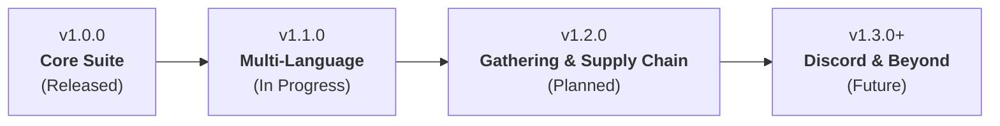

# 🗺️ GSFHub Development Roadmap

This document outlines the version roadmap and upcoming features for **GSFHub (Guild Self-Found Hub)**.

---

## 📌 Release Schedule & Milestone Overview

---

## 🚀 Released Versions

### ✅ v1.0.0 - Foundation & Core Suite *(Released)*
- [x] **Decentralized Profession Directory:** Auto-scans trade skills (Alchemy, BS, Enchanting, Engi, LW, Tailoring, JC, Cooking, First Aid, Lockpicking).
- [x] **Persistent Offline Recipe Index:** Search recipes and crafters across all guild members even when they are offline.
- [x] **Work Orders & Crafting Requests Board:** Post crafting/enchanting requests with material toggles and crafter claiming.
- [x] **Surplus Material Exchange:** Share extra materials, ores, herbs, and cloth directly from bags without a guild bank alt.
- [x] **Recipe Drop Coordinator & Wishlist:** Detects recipe drops in party/raid, cross-references unlearned crafters and personal wishlists.
- [x] **Fast-Track Trade & Mail Helpers:** Auto-stages crafting mats into Trade and Mail frames.
- [x] **Main / Alt Identity:** Group characters under a primary main account.
- [x] **P2P Sync Engine:** Peer-to-peer sync with `LibDeflate` compression over the hidden `GUILD` channel.

---

## 🔮 Upcoming Milestones

### 🌐 v1.1.0 - Multi-Language Architecture *(Next Up)*
- [ ] **Client Auto-Detection:** Automatically detects WoW client locale via `GetLocale()` (defaults to German on `deDE` clients, English `enUS` otherwise).
- [ ] **In-Game Language Switcher:** Dropdown in the Settings tab to switch between *"Auto (Client-Sprache)"*, *"English (enUS)"*, and *"Deutsch (deDE)"* with real-time UI refresh.
- [ ] **Authentic German Dictionary (`Locales/deDE.lua`):** Complete translations for all tabs, professions, work orders, surplus stockpile, drops, toasts, and slash commands.
- [ ] **Bulletproof Fallback Engine:** Guarantees zero blank labels by seamlessly falling back to English for unlocalized keys.

---

### 🌾 v1.2.0 - Gathering Suite & Guild Supply Chain *(Planned)*
- [ ] **Guild Roles System (`Core/Roles.lua`):** Role badges (`Gatherer`, `Crafter`, `Angler/Cook`, `Miner`, `Herbalist`, etc.) with automated profession detection and custom user tags.
- [ ] **Crafter ➔ Gatherer Bounties (`Modules/SupplyChain/`):** 1-click recipe breakdown turning missing crafting reagents into targeted bounties for guild gatherers.
- [ ] **TBC Resource Farming Atlas (`Modules/Gathering/Atlas.lua`):** In-game encyclopedia of all TBC nodes (Mining, Herbs, Skinning, Primals, Fish) with required skill, best zones, and food buff notes.
- [ ] **Personal Farming Goals HUD (`Modules/Gathering/PersonalGoals.lua`):** Set personal quotas (e.g. *200x Furious Crawdad*), track live bag count with a visual progress bar, and 1-click cook or post surplus once complete.
- [ ] **Gatherer Service Broadcasts (`Modules/Gathering/ServiceOfferings.lua`):** Publish active farming sessions so crafters can whisper active farmers in real-time.

---

### 🔮 v1.3.0 & Beyond - Discord Integration & Community Extensions
- [ ] **Discord Bot & Web Export Integration:** One-click JSON/text export string to view guild crafters, work orders, and known recipes in Discord channels or a web viewer.
- [ ] **Community-Driven Enhancements:** Future features prioritized based on guild feedback and user suggestions.

---

## 💬 Community Feedback & Feature Requests
Have an idea or want to request a feature? Feel free to open an **[Issue](https://github.com/VhelCodez/GSFHub/issues)** or start a **[Discussion](https://github.com/VhelCodez/GSFHub/discussions)** on GitHub!
