# 🗺️ GSFHub Development Roadmap

This document outlines the version roadmap and upcoming milestones for **GSFHub (Guild Self-Found Hub)**.

---

## 📌 Release Schedule & Milestone Overview

```mermaid
graph LR
    v10["v1.0.0<br/><b>Core Suite</b><br/>(Released)"] --> v11["v1.1.0<br/><b>Multi-Language</b><br/>(Released)"]
    v11 --> v12["v1.2.3<br/><b>Gathering & Atlas</b><br/>(Released)"]
    v12 --> v124["v1.2.4<br/><b>UI Harmonization</b><br/>(Released)"]
    v124 --> v125["v1.2.5<br/><b>Scope Isolation</b><br/>(Released)"]
    v125 --> v126["v1.2.6<br/><b>Wishlist & Goals Scope</b><br/>(Released)"]
    v126 --> v127["v1.2.7<br/><b>Cache Suite</b><br/>(Released)"]
    v127 --> v13["v1.3.0<br/><b>Phase 3: Universal Atlas</b><br/>(Released)"]
    v13 --> v131["v1.3.1<br/><b>Master Expansion & CRAFT</b><br/>(Released)"]
    v131 --> v132["v1.3.2<br/><b>Supply Chain & Goals</b><br/>(Released)"]
    v132 --> v14["v1.4.0<br/><b>Phase 4: Navigation & QoL</b><br/>(Next Up)"]
    v14 --> v15["v1.5.0<br/><b>Phase 5: Specializations & CDs</b><br/>(Planned)"]
    v15 --> v16["v1.6.0<br/><b>Phase 6: TBC Guild Vault</b><br/>(Planned)"]
    v16 --> v17["v1.7.0<br/><b>Phase 7: Guild Intelligence</b><br/>(Planned)"]
```

---

## 🚀 Released Milestones

### ✅ v1.3.2 - Guild Supply Chain, Two-Sided Bounties & Goal Management Suite *(Released)*
- [x] **Two-Sided Delivery Verification Handshake:** In-person handoffs marked with `[Geliefert melden]` / `[Verschicken]` require explicit confirmation `[Erhalt bestätigen]` by the requester, with `[Nicht erhalten]` rejection to protect against dishonest completions.
- [x] **Real-Time Bag Inventory Tracking:** Dynamic `In Taschen: X/Y` inventory tracking on claimed bounties backed by `BAG_UPDATE` events, with `GSF_CONFIRM_FULFILL_BOUNTY_INSUFFICIENT` confirmation safeguards.
- [x] **Atlas Goals ➔ Bounties Interactive Linking:** Pinned bounty goals feature requester tags (`[Gilden-Auftrag] • Von: <Name>`) and a direct **[Auftrag]** button that auto-scrolls to the card with viewport bounds checking and a 3-second radiant golden glow highlight.
- [x] **Top-5 Prioritized Goals HUD Clamping:** The floating screen HUD displays only your top 5 prioritized goals, reorderable via drag-and-drop or arrows with a `+X weitere im Atlas verwalten` quick-access footer.
- [x] **Multi-Toast Queue & Frame Pooling Architecture (`Toast.lua`):** Upgraded toast engine with frame pooling, 3-card vertical stacking, automatic FIFO queueing, sound alert throttling, and default silent mode.
- [x] **3-Line Bounty Card Layout Overhaul:** Expanded card height to 72px (78px vertical pitch) with zero text/button collisions, clean note truncation with hover tooltips, and shortened **`Annehmen`** button labels.
- [x] **Surgical Multi-Bounty HUD Isolation:** Pinned goals bound to unique `bountyId` references so unclaiming one bounty of multiple identical materials never purges neighboring goals.
- [x] **Self-Claiming Support:** Allowed players to claim and fulfill their own open Work Orders and Material Bounties for streamlined alt/self-farming workflows.

### ✅ v1.3.1 - AtlasJournal Master Catalog Audit, Bugfix & CRAFT Architecture *(Released)*
- [x] **Master Catalog Expansion (147 ➔ 236 Items):** Full coverage across Mining (50), Herbalism (40), Skinning (29), Cloth (11), Elemental (31), Enchanting (30), Cooking (18), and Fishing (27).
- [x] **Authentic Bugfixes & Data Correction:** Corrected Nethercite Ore (`32464`), separated Knothide Leather Scraps (`25649`) from Fel Hide (`25707`), aligned all TBC fish with WoWHead database IDs, and synchronized Swiftthistle (`2452`) and Grave Moss (`3369`) tip keys.
- [x] **First-Class `CRAFT` Source Architecture:** Integrated profession conversion recipes with spell IDs, required skill ranks, input reagent counts (`count`), and multi-item yield amounts (`yieldCount`).
- [x] **Bilingual Strategic Farming & Lore Tips:** Added 93 new localized farming tips in `enUS` and `deDE` with 100% dictionary match across 271 keys.
- [x] **UI & Goals HUD Polishing:** Hardened placeholder icon detection (`IsPlaceholderIcon`), improved `ScrollList` hideable scrollbar math, and added interactive ingredient count badges to the Atlas interface.

### ✅ v1.3.0 - Phase 3: Universal Resource Atlas & Standalone `AtlasJournal` Library *(Released)*
- [x] **Standalone Decoupled Library (`Libs/AtlasJournal/`):** Refactored gathering engine into `AtlasJournal` (`LibAtlasJournal-1.0`), an independent, headless library with event-driven callback system (`ON_DATA_READY`), embedded locales (`enUS` / `deDE`), standalone TOC, and isolated verification test (`verify.ps1`).
- [x] **Pure ID-Driven Relational Schema (`AtlasJournalData.lua`):** Decouples physical world nodes from materials. Every record is an inventory material keyed by its official Blizzard `itemID`, with zone metadata resolved via native `areaID` (`C_Map.GetAreaInfo`) and categories via `GetSpellInfo` / `GetItemSubClassInfo`.
- [x] **13 Polymorphic Source Types (`src.type`):** Unified modeling of all acquisition vectors without bespoke logic (`GATHER`, `PROSPECT`, `DISENCHANT`, `EXTRACT`, `TRANSMUTE`, `SMELT`, `COMBINE`, `MOB_DROP`, `FISH`, `BYPRODUCT`, `VENDOR`, `INSTANCE`, `CONTAINER`).
- [x] **Cross-Discipline Category Filtering (`MatchesCategory`):** Multi-source items appear across all relevant profession filters (e.g. `Partikel des Wassers` appears when filtering for Elemental, Fishing, and Engineering).
- [x] **Comprehensive Classic & TBC Catalog:** Complete verified dataset across Mining, Herbalism, Skinning, Disenchanting, Gas Extraction, Farmed Meats, Primals, and Raid Catalysts.
- [x] **Zero-String Multilingual Localization:** 100% dynamic localized name, icon, and zone resolution via client engine APIs (`GetItemInfo`, `C_Map.GetAreaInfo`, `GetSpellInfo`).
- [x] **Pre-Flight Engine Cache & Reactive UI (`AtlasJournal.lua`):** Asynchronous item cache priming on login with debounced `GET_ITEM_INFO_RECEIVED` reactive visual updates for zero-lag browsing.
- [x] **Direct Downstream Integration:** Direct `itemID` binding for `GoalsHUD.lua` (strictly querying exact item count) and `SupplyBounties.lua` (1-click bounty requests).

### ✅ v1.2.7 - Settings Data & Cache Management Suite *(Released)*
- [x] **Non-Destructive Guild Cache Rebuilder (`GSF.DB:RebuildGuildCache()`):** Purges peer member records and foreign listings while keeping player listings intact, immediately re-syncing from online guild members.
- [x] **Active Character Data Reset (`GSF.DB:ResetActiveCharacterData()`):** Clears the current character's wishlist and Goals HUD trackers with a confirmation dialog.
- [x] **Safe Full Addon Reset (`GSF.DB:FactoryReset()`):** Ghost-order-preventing factory reset that cancels open work orders and bounties over the guild channel before resetting SavedVariables.
- [x] **Symmetrical Settings Layout (`TabSettings.lua`):** 2x2 card grid with pixel-balanced heights, unifying General Display and Cache Management.

### ✅ v1.2.6 - Character Scope Isolation for Wishlists & Goals *(Released)*
- [x] **Per-Character Recipe Wishlist Scoping (`wishlistByChar`):** Partitioned recipe wishlists by character key (`"<CharacterName> - <RealmName>"`). Pinned recipes on an engineering alt no longer bleed into newly created or other guild characters.
- [x] **Smart Non-Destructive Wishlist Migration:** Automatically attributes legacy account-level wishlists to the character that originally created them (via work order requester history or designated main), granting new characters an immediate clean slate while preserving existing wishlists.
- [x] **Per-Character Personal Goals Isolation (`goalsByChar`):** Partitioned `myGoals` by character so pinned Goals HUD trackers and bag counters remain isolated to each character's active inventory.
- [x] **Peer Wishlist Loot Tracking (`RecipeDrops.lua` & `Sync.lua`):** Saved incoming member wishlists to guild cache records, enabling group recipe drop alerts to accurately flag any guild member who has the dropped recipe on their personal wishlist.

### ✅ v1.2.5 - Multi-Guild & Solo Scope Isolation Suite *(Released)*
- [x] **Partitioned Scoped Cache (`GSFHubCache.scopes`):** Partitioned by `Guild - <GuildName> - <RealmName>` and `Solo - <PlayerName> - <RealmName>`, isolating guild data from foreign characters.
- [x] **Active Guild Roster Pruning:** Automatic pruning of non-guild characters, work orders, bounties, and alts upon roster updates.
- [x] **P2P Gossip Network Firewall:** `SendMyData()` strictly sends active character's contributions within the active guild scope.
- [x] **Per-Character Scoped Professions:** `GSF.DB:GetMyProfessions()` prevents profession filtering leaks across alts.
- [x] **Zero-Loss Legacy Migration:** Safely migrates existing flat cache data into scoped partitions.

### ✅ v1.2.4 - UI Harmonization & Alignment Suite *(Released)*
- [x] **Subpixel Checkbox Label Calibration:** Exactly 12px measured gap between checkbox border and text across `Berufe`, `Aufträge`, and `Atlas`.
- [x] **Beute & Wunsch Dual-Column Architecture:** Symmetrical two-column view (Recipe Drops left, Wishlist right) with unified search and centered modal dialog.
- [x] **Professions Action Bar Streamlining:** Symmetrical 2-button crafting layout (`[Herstellung anfragen]` and `[Material anfordern]`) with zero clipping.
- [x] **Atlas Navigation & Empty States:** Right-aligned 90px view buttons, empty list notifications across all 3 views, and centered empty notices.
- [x] **Gilde & Sync Redesign:** Streamlined top bar, expanded roster table down to bottom bar, and bottom-left Main/Alt management.
- [x] **Goal HUD Visual Polish:** Note icon hugs title text (`Kupfererz 📜`), 14x14px level header buttons with cropped texture padding, subtle delete buttons, and GSF mint progress bars.
- [x] **FrameStrata Hierarchy Layering:** `MainFrame` in `"HIGH"` strata with `SetToplevel(true)` and `GoalsHUD` in `"MEDIUM"` strata, preventing z-fighting.
- [x] **Reliable Item Preview Clear:** Instant slot reset on empty editbox input across backspaces, right-clicks, and `×` button clicks.
- [x] **Dynamic Modal Localization:** Live language updates across all dialog titles, labels, checkboxes, and buttons.

### ✅ v1.2.3 - Test Phase 2 Polish & Input Enhancements *(Released)*
- [x] **Escape Key Close (`UISpecialFrames`):** Pressing `ESC` closes the window cleanly.
- [x] **Dynamic Header Subtitles:** Replaces static version display with live tab title subtitles.
- [x] **Universal Shift-Click Bag Item Paste:** Seamless bag link parsing into active GSF edit boxes without stack-splitting.
- [x] **Drag-and-Drop `ItemSlot` Preview:** Reusable Blizzard slot with 250ms debounced live icon resolution.
- [x] **Bounty Lifecycle Management:** Own bounty cancellation, gatherer unclaiming, completed bounty dismissal, and hide completed filter.
- [x] **Option B Material Request Modal:** Item preview slot, quantity input, and custom notes.
- [x] **Surplus & Atlas Polish:** Soulbound filtering, bag row selection highlight, German zone/yield localization, and layout collision fixes.

### ✅ v1.2.2 - Settings View & Quality-of-Life Polish *(Released)*
- [x] **Dedicated Settings View (`TabSettings.lua`):** Modular card layout for Language, Minimap, Goals HUD, Audio, and Diagnostics.
- [x] **Header Cog Button (`[⚙]`):** Fast 1-click access to Settings from any view while preserving 6 bottom tabs.
- [x] **Goals HUD Two-Way State Synchronization:** Live binding between UI checkbox and HUD frame events.
- [x] **Decoupled Audio Alerts:** Audio chimes play independently of visual toast frame suppression.
- [x] **Mining Node Localized Names:** Dedicated German vein name resolution (*Kupfervorkommen*, *Eisenvorkommen*, etc.).
- [x] **German Recipe Drop Detection:** `classID == 9` and German prefix support (*Muster:*, *Pläne:*, *Rezept:*).
- [x] **Work Order Editing & Completion Confirmation:** Edit own open orders and confirmation safety prompt on completion.

### ✅ v1.2.1 - Client Compatibility & UI Fixes *(Released)*
- [x] **Modern Container API Traps:** Resolved `attempt to call a nil value` across bag slot querying.
- [x] **UI Layout Collision Adjustments:** Dynamic tab resizing and layout spacing fixes.
- [x] **Full Dual-Language Key Parity:** Added complete German dictionary keys.

### ✅ v1.2.0 - Gathering Suite & Guild Supply Chain *(Released)*
- [x] **1–375 Resource Farming Atlas (`AtlasData.lua`):** Complete encyclopedia of Vanilla (1–300) and TBC (300–375) resources with native multilingual `itemID` resolution.
- [x] **Crafter ➔ Gatherer Supply Chain Bounties (`SupplyBounties.lua`):** 1-click recipe breakdown into material requests.
- [x] **In-Transit Postal Tracking:** Full postal lifecycle (`OPEN`, `CLAIMED`, `IN_TRANSIT`, `COMPLETED`) with real-time transit duration timer.
- [x] **3-Factor Verification Handshake:** Automatic mail receipt detection verifying sender, token, and item quantities upon mailbox opening and bag loot.
- [x] **Guild Role Specializations (`Roles.lua`):** Role badges (`[⛏️ Miner]`, `[🌿 Herbalist]`, `[🔪 Skinner]`, `[✨ Master Crafter]`) rendered in Roster and tooltips.
- [x] **Draggable Personal Goals HUD (`GoalsHUD.lua`):** Draggable onscreen tracker with real-time bag loot auto-counters.
- [x] **Resource Atlas UI Tab (`TabAtlas.lua`):** 6-tab expansion with category/skill filters, search, and 1-click pin/request buttons.

### ✅ v1.1.0 - Multi-Language Architecture & Version Reminders *(Released)*
- [x] **Client Auto-Detection:** Automatically detects WoW client locale via `GetLocale()` (defaults to German on `deDE` clients, English `enUS` otherwise).
- [x] **In-Game Language Switcher:** Dropdown in the Settings tab to switch between *"Auto"*, *"English"*, and *"Deutsch"* with real-time UI refresh.
- [x] **Authentic German Dictionary (`Locales/deDE.lua`):** Complete translations with guaranteed English fallback safety.
- [x] **P2P Version Gossip & Update Reminders:** In-game alert when guild members run a newer version with a 1-click copy dialog.
- [x] **In-Game Diagnostic & Bug Report Helper:** `/gsf bug` command generating pre-formatted GitHub issue diagnostics.

### ✅ v1.0.0 - Foundation & Core Suite *(Released)*
- [x] **Decentralized Profession Directory:** Auto-scans 10 trade skills.
- [x] **Persistent Offline Recipe Index:** Search recipes and crafters across all guild members even when offline.
- [x] **Work Orders & Crafting Requests Board:** Post crafting/enchanting requests with material toggles and crafter claiming.
- [x] **Surplus Material Exchange:** Share extra materials directly from bags without a guild bank alt.
- [x] **Recipe Drop Coordinator & Wishlist:** Detects recipe drops in party/raid, cross-references unlearned crafters and wishlists.
- [x] **Fast-Track Trade & Mail Helpers:** Auto-stages crafting mats into Trade and Mail frames.
- [x] **P2P Sync Engine:** Peer-to-peer sync with `LibDeflate` compression over the hidden `GUILD` channel.

---

## 🔮 Upcoming Milestones

### 🧭 Phase 4 (`v1.4.0`) - Navigation Overhaul & Personal QoL Suite *(Next Up)*
*Detailed plan:* [`.gemini/plans/phase_4_implementation_plan.md`](.gemini/plans/phase_4_implementation_plan.md)
- [ ] **Hybrid Pinned + Overflow Navigation (`[ ⋯ More ▼ ]`):** Customizable tab bar with overflow dropdown and active label display.
- [ ] **Cross-Character Account Cooldown Alarms (`Cooldowns.lua`):** Onscreen toast & audio chime on your main when an alt's trade skill CD is ready.
- [ ] **Active Gatherer Radar (`GathererRadar.lua`):** Field farming session broadcaster and live radar board.
- [ ] **Universal Guild Material Search:** 1-box search across all surplus, trade offers, and crafter capabilities.

---

### 🛠️ Phase 5 (`v1.5.0`) - Crafting Specializations & Shared Cooldowns *(Planned)*
*Detailed plan:* [`.gemini/plans/phase_5_implementation_plan.md`](.gemini/plans/phase_5_implementation_plan.md)
- [ ] **Profession Sub-Specializations (`Specializations.lua`):** Auto-detection & badges for Tailoring, Blacksmithing, Leatherworking, Alchemy, Engineering.
- [ ] **Specialization Planning & In-Game Quest Roadmaps:** Aspirational `(Planned: ...)` tags with built-in quest walkthroughs and turn-in checklists.
- [ ] **Shared Guild Cooldown Monitor:** Live cooldown availability tags displayed next to crafter names on recipes.

---

### 🏛️ Phase 6 (`v1.6.0`) - TBC Guild Bank & Vault Automation Suite *(Planned)*
*Detailed plan:* [`.gemini/plans/phase_6_implementation_plan.md`](.gemini/plans/phase_6_implementation_plan.md)
- [ ] **TBC Guild Vault Scanner & Remote Mirror (`GuildBankScanner.lua`):** Silent snapshot scanning with revision digests (< 1 KB) allowing remote vault browsing anywhere.
- [ ] **Smart Bank Tab Tagging & Surplus Sync (`VaultSurplus.lua`):** Designate bank tabs as surplus stockpiles (`[🏛️ Guild Vault]`) for holiday absences.
- [ ] **Direct-to-Vault Bounties & 1-Click Deposit Helper:** Restock bounties targeted for the bank vault with 1-click deposit.
- [ ] **Minimum Reserve Thresholds & Auto-Restock Alerts (`ReserveThresholds.lua`):** Configurable low-stock alerts.
- [ ] **Remote Guild Bank Browser Tab (`TabGuildBank.lua`):** Search and browse all accessible guild bank tabs.

---

### 📊 Phase 7 (`v1.7.0`) - Guild Intelligence, Economy & Social Suite *(Planned)*
*Detailed plan:* [`.gemini/plans/phase_7_implementation_plan.md`](.gemini/plans/phase_7_implementation_plan.md)
- [ ] **Macro Economy Analytics & Intelligent Advisory (`EconomyStats.lua`):** Crafter/gatherer ratios and "Guild Needs" recommendations.
- [ ] **Streamlined Stockpile & Shortage Watcher (`StockpileWatcher.lua`):** Target vs. stock table with 1-click bounty requests.
- [ ] **Guild Recipe Knowledge Matrix & Gap Analysis (`KnowledgeMatrix.lua`):** Covered raid patterns vs. unlearned gaps with drop info.
- [ ] **Activity Ledger & Honor Roll Leaderboard (`ActivityLedger.lua`):** Decentralized live event timeline and contributor recognition.

---

## 💬 Community Feedback & Feature Requests
Have an idea or want to request a feature? Feel free to open an **[Issue](https://github.com/VhelCodez/GSFHub/issues)** or start a **[Discussion](https://github.com/VhelCodez/GSFHub/discussions)** on GitHub!
